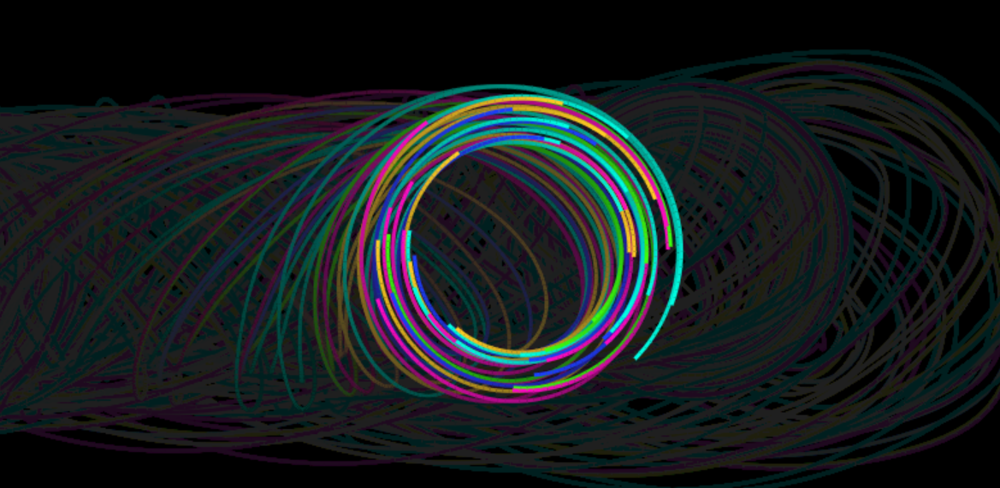

# CIRCULAR_DOTS
CIRCULAR_DOTS is a simple and interactive canvas built with HTML, CSS, and (vanilla) JavaScript.

 ​ ​ ​ ​ ​ ​ ​ ​ ​ ​ ​ ​ ​ ​ ​ ​ ​ ​ ​ ​ ​ ​ ​ ​ 

## Feature
On page load, 50 dots will be spawned. They will be moving in circular motion with an angular velocity of 0.05 radiants. The center of rotation is the same for all dots.

A light trail is left on the canvas by the dots.

Move the mouse inside the page: the center of rotation will follow the cursor.

## Usage
Download the repository and open index.html.

## Contributing
Pull requests are welcome. For major changes, please open an issue first to discuss what you would like to change.

Please make sure to update tests as appropriate.

## License 
